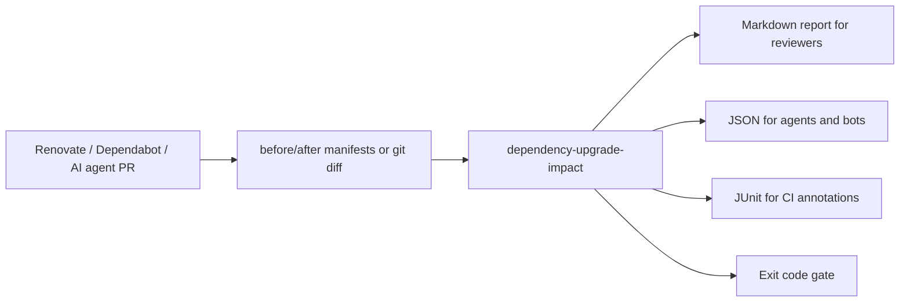

# dependency-upgrade-impact

[](https://github.com/yanqr213/dependency-upgrade-impact/actions/workflows/ci.yml)


dependency-upgrade-impact 是一个离线依赖升级影响分析工具，面向 DevTools、依赖治理、CI 和 AI coding agent 工作流。它比较升级前后的 `package-lock.json`、`package.json`、`requirements.txt`、`pyproject.toml` 或 unified diff，识别直接/间接依赖变化、SemVer 风险、许可/engine/安装脚本提示、受影响源码 import、建议测试范围，并输出 Markdown、JSON、JUnit 报告与 CI gate 退出码。

项目只使用 Python 标准库，兼容 Python 3.9+，没有外部运行时依赖。

## 30 秒价值

当 Renovate、Dependabot 或 AI coding agent 提交依赖升级 PR 时，这个工具可以在不访问 npm/PyPI 的情况下回答三个问题：

- 这次到底升级了哪些直接/间接依赖，风险高低如何？
- 哪些源码文件真的 import/require 了这些依赖，应该优先看哪里？
- CI 是否应该放行，还是因为 major 升级、安装脚本、engine 约束或许可变化而阻断？

```bash
PYTHONPATH=src python -m dependency_upgrade_impact \
  --before examples/before \
  --after examples/after \
  --source-root examples/source \
  --format markdown \
  --language zh \
  --fail-on none
```

真实样例会识别 8 个依赖变化、4 个 major 升级、2 个 high risk 项，并指出 `react`、`left-pad`、`fastapi`、`requests` 命中的源码文件。完整演示见 [docs/showcase.md](docs/showcase.md)。

## 工作流



## 适用场景

- 依赖升级 PR：自动说明哪些包升级、风险等级、建议跑哪些测试。
- AI agent 编码辅助：agent 完成依赖升级后，用结构化 JSON 反查需要验证的源码与测试。
- CI gate：major 升级、安装脚本、可疑许可、源码命中等风险达到阈值时阻断流水线。
- 离线审计：不访问 npm、PyPI 或许可证服务，适合内网、私有仓库、无 token 环境。
- 双语报告：默认中文，也可以通过 `--language en` 输出英文 Markdown/JSON/JUnit。

## 安装

开发模式：

```bash
python -m pip install -e .
```

不安装也可以直接运行：

```bash
PYTHONPATH=src python -m dependency_upgrade_impact --help
```

Windows PowerShell：

```powershell
$env:PYTHONPATH="src"
python -m dependency_upgrade_impact --help
```

## CLI 用法

比较两个目录：

```bash
dependency-upgrade-impact \
  --before examples/before \
  --after examples/after \
  --source-root examples/source \
  --format markdown \
  --output reports/impact.md
```

输出 JSON 给 agent 或后续脚本：

```bash
dependency-upgrade-impact --before old --after new --format json --fail-on none
```

从 unified diff 分析：

```bash
dependency-upgrade-impact --diff examples/diff.patch --format junit --output reports/deps.xml
```

常用参数：

- `--before`：升级前目录或单个支持文件。
- `--after`：升级后目录或单个支持文件。
- `--diff`：包含支持文件变更的 unified diff；与 `--before` 互斥。
- `--source-root`：源码目录，用于扫描 Python/JS/TS import。
- `--format`：`markdown`、`json`、`junit`。
- `--language`：`zh`、`en`，默认 `zh`。
- `--output`：报告文件路径；不传则输出到 stdout。
- `--fail-on`：`none`、`low`、`medium`、`high`，默认 `high`。
- `--min-score`：风险分达到该值时 CI gate 失败。

退出码：

- `0`：分析成功，gate 通过。
- `1`：输入、解析或 IO 错误。
- `2`：分析成功，但风险达到 gate 阈值。

## Python API

```python
from dependency_upgrade_impact import analyze
from dependency_upgrade_impact.reporters import render

result = analyze(
    before_path="examples/before",
    after_path="examples/after",
    source_root="examples/source",
    fail_on="high",
)

print(result.summary.total_changes)
print(render(result, "json", language="zh"))
```

核心对象：

- `AnalysisResult`：包含 `changes`、`summary`、`source_files`、`warnings`。
- `DependencyChange`：包含依赖名、生态、变更类型、版本、SemVer、风险分、命中源码、建议测试。
- `AnalysisSummary`：包含总数、added/removed/updated、major/minor/patch、high/medium/low 和 gate 状态。

## 输入格式

支持以下文件，目录输入会自动查找这些文件：

- `package.json`：读取 `dependencies`、`devDependencies`、`optionalDependencies`、`peerDependencies`，并提取根 `engines` 与 `scripts` 作为提示。
- `package-lock.json`：支持 lockfile v2/v3 的 `packages` 与旧式 `dependencies`，读取版本、直接/间接、dev scope、license、engines、scripts。
- `requirements.txt`：支持常见 pinned/range 依赖，如 `requests==2.32.3`、`urllib3>=2.0`，忽略注释、空行、`-r`、index 配置与 URL 依赖。
- `pyproject.toml`：支持标准 `[project] dependencies`、`[project.optional-dependencies]`，以及 Poetry 的 `[tool.poetry.dependencies]`、`[tool.poetry.group.*.dependencies]`。
- unified diff：支持普通 `git diff` 输出，提取支持文件的 before/after 内容再分析。

## 解析与评分规则

版本比较采用轻量 SemVer：

- major：主版本变大。
- minor：主版本相同、次版本变大。
- patch：主次版本相同、补丁版本变大。
- downgrade：版本回退。
- unknown：git/file/workspace/URL 或无法解析的版本。

风险评分为 0-100，主要信号包括：

- 变更类型：新增、移除、更新。
- SemVer：major > minor > patch。
- 直接/间接依赖：间接变化会提示上游树风险。
- 源码使用：扫描 Python `import/from` 和 JS/TS `import/export/require`。
- 许可：许可变化、GPL/AGPL/LGPL/SSPL/proprietary/unknown 等需要人工复核。
- engine：依赖或 manifest 声明运行时版本约束。
- scripts：`install`、`postinstall`、`preinstall`、`prepare` 等安装期脚本。

风险等级：

- `low`：0-39
- `medium`：40-69
- `high`：70-100

## 测试映射

`--source-root` 开启源码扫描后，工具会：

- Python：用 `ast` 解析 `import x`、`from x import y`。
- JS/TS：识别静态 `import`、`export ... from`、`require(...)`。
- 跳过 `.git`、`node_modules`、`dist`、`build`、虚拟环境与缓存目录。
- 根据命中的源码路径与测试文件名/目录，建议相关 `tests/`、`test_*.py`、`*.test.ts`、`*.spec.ts` 等测试。

## CI 集成

GitHub Actions 示例：

```yaml
name: Dependency impact

on: [pull_request]

jobs:
  dependency-impact:
    runs-on: ubuntu-latest
    env:
      PYTHONPATH: src
    steps:
      - uses: actions/checkout@v4
      - uses: actions/setup-python@v5
        with:
          python-version: "3.12"
      - run: python -m unittest discover -s tests
      - run: >
          python -m dependency_upgrade_impact
          --before examples/before
          --after examples/after
          --source-root examples/source
          --format junit
          --output reports/dependency-impact.xml
          --fail-on high
```

如果你的 CI 可以提供升级前目录和升级后目录，使用 `--before/--after` 最稳。如果只能拿到 patch，使用 `--diff`。

## Agent 集成

AI coding agent 升级依赖后可以执行：

```bash
python -m dependency_upgrade_impact --before .agent/before --after . --source-root . --format json --language zh --fail-on none
```

推荐 agent 使用 JSON 中的字段：

- `summary.gate_failed`：是否需要暂停并请求人工确认。
- `changes[].risk_level` 与 `changes[].risk_score`：排序验证优先级。
- `changes[].usage_files`：要重点查看的源码。
- `changes[].suggested_tests`：优先运行的测试。
- `changes[].reasons`、`engine_hints`、`script_hints`：生成 PR 说明或审计摘要。

## 限制

- 工具完全离线，不查询 npm/PyPI，因此无法补全注册表上的最新许可、漏洞公告或 release notes。
- `pyproject.toml` 使用内置小范围 TOML 解析器，覆盖常见依赖字段，不目标替代完整 TOML 实现。
- JS/TS 扫描是静态正则识别，不解析动态 import、模板字符串、运行时插件加载。
- Python 包名到 import 名的映射采用规范化与 `-`/`_` 互换，无法覆盖所有历史命名差异。
- `package-lock.json` 的依赖树关系目前以 direct/transitive 提示为主，不构建完整可视化树。

## 开发指南

运行测试：

```bash
PYTHONPATH=src python -m unittest discover -s tests
```

运行示例：

```bash
PYTHONPATH=src python -m dependency_upgrade_impact \
  --before examples/before \
  --after examples/after \
  --source-root examples/source \
  --format markdown \
  --fail-on none
```

目录结构：

- `src/dependency_upgrade_impact/`：核心库与 CLI。
- `tests/`：标准库 `unittest` 测试。
- `examples/before`、`examples/after`：示例依赖输入。
- `examples/source`：用于 import 扫描和测试映射的示例源码。
- `.github/workflows/ci.yml`：GitHub Actions CI 示例。

贡献时请保持：

- Python 标准库优先，避免新增运行时依赖。
- 新解析规则必须有单元测试。
- 新风险规则要能解释原因，并出现在 Markdown/JSON 报告中。
- 不提交真实 token、私有仓库 URL 或个人信息。

---

# English

dependency-upgrade-impact is an offline dependency upgrade impact analyzer for DevTools, dependency management, CI, and AI coding agent workflows. It compares before/after dependency files or a unified diff, detects direct and transitive dependency changes, classifies SemVer impact, adds license/engine/install-script hints, scans affected Python/JS/TS imports, suggests test scope, and emits Markdown, JSON, or JUnit reports with CI-friendly exit codes.

The project uses only the Python standard library, supports Python 3.9+, and has no runtime dependencies.

## 30-Second Value

When Renovate, Dependabot, or an AI coding agent opens a dependency upgrade PR, this tool answers three review questions without calling npm, PyPI, or any external service:

- Which direct or transitive dependencies changed, and how risky are they?
- Which source files actually import or require the changed packages?
- Should CI pass, or should the PR stop because of a major upgrade, install script, engine constraint, or license signal?

```bash
PYTHONPATH=src python -m dependency_upgrade_impact \
  --before examples/before \
  --after examples/after \
  --source-root examples/source \
  --format markdown \
  --language en \
  --fail-on none
```

The bundled example finds 8 dependency changes, 4 major upgrades, 2 high-risk items, and affected files for `react`, `left-pad`, `fastapi`, and `requests`. See [docs/showcase.md](docs/showcase.md) for the full walkthrough.

## Workflow


## Use Cases

- Dependency upgrade pull requests: explain what changed, how risky it is, and which tests should run.
- AI coding agents: after an agent upgrades dependencies, provide structured JSON describing validation targets.
- CI gates: fail builds when major upgrades, install scripts, suspicious licenses, or source usage reach a configured risk threshold.
- Offline audits: no npm, PyPI, vulnerability feed, token, or network access is required.
- Bilingual reports: Chinese by default, or English Markdown/JSON/JUnit with `--language en`.

## Installation

Editable install:

```bash
python -m pip install -e .
```

Run without installing:

```bash
PYTHONPATH=src python -m dependency_upgrade_impact --help
```

PowerShell:

```powershell
$env:PYTHONPATH="src"
python -m dependency_upgrade_impact --help
```

## CLI

Compare two directories:

```bash
dependency-upgrade-impact \
  --before examples/before \
  --after examples/after \
  --source-root examples/source \
  --format markdown \
  --output reports/impact.md
```

Emit JSON for an agent:

```bash
dependency-upgrade-impact --before old --after new --format json --fail-on none
```

Analyze a unified diff:

```bash
dependency-upgrade-impact --diff examples/diff.patch --format junit --output reports/deps.xml
```

Options:

- `--before`: directory or supported dependency file before the upgrade.
- `--after`: directory or supported dependency file after the upgrade.
- `--diff`: unified diff containing supported files; mutually exclusive with `--before`.
- `--source-root`: source tree used for import scanning and test suggestions.
- `--format`: `markdown`, `json`, or `junit`.
- `--language`: `zh` or `en`; default is `zh`.
- `--output`: write report to a file; stdout is used by default.
- `--fail-on`: `none`, `low`, `medium`, or `high`; default is `high`.
- `--min-score`: fail the CI gate when any change reaches this score.

Exit codes:

- `0`: analysis succeeded and the gate passed.
- `1`: input, parse, or IO error.
- `2`: analysis succeeded but the configured gate failed.

## Python API

```python
from dependency_upgrade_impact import analyze
from dependency_upgrade_impact.reporters import render

result = analyze(
    before_path="examples/before",
    after_path="examples/after",
    source_root="examples/source",
    fail_on="high",
)

print(result.summary.total_changes)
print(render(result, "json", language="en"))
```

Main objects:

- `AnalysisResult`: `changes`, `summary`, `source_files`, and `warnings`.
- `DependencyChange`: dependency name, ecosystem, change type, versions, SemVer class, risk score, affected files, and suggested tests.
- `AnalysisSummary`: counts, risk distribution, max score, and gate state.

## Inputs

Supported files:

- `package.json`: reads `dependencies`, `devDependencies`, `optionalDependencies`, `peerDependencies`, root `engines`, and root `scripts`.
- `package-lock.json`: supports lockfile v2/v3 `packages` and legacy `dependencies`; reads versions, direct/transitive hints, dev scope, license, engines, and scripts.
- `requirements.txt`: supports common pinned/range requirements; ignores comments, blank lines, `-r`, index options, and URL dependencies.
- `pyproject.toml`: supports standard `[project] dependencies`, `[project.optional-dependencies]`, and Poetry dependency sections.
- Unified diff: extracts before/after content for supported files from ordinary `git diff` output.

## Rules

SemVer classes:

- `major`: major version increased.
- `minor`: same major, minor increased.
- `patch`: same major and minor, patch increased.
- `downgrade`: version decreased.
- `unknown`: git/file/workspace/URL or otherwise unparsable versions.

Risk scoring is a 0-100 heuristic based on:

- Change type: added, removed, updated.
- SemVer class: major > minor > patch.
- Direct versus transitive dependency hints.
- Source usage from Python imports and JS/TS imports/requires.
- License changes and risky markers such as GPL, AGPL, LGPL, SSPL, proprietary, or unknown.
- Runtime engine constraints.
- Install-time scripts such as `install`, `postinstall`, `preinstall`, and `prepare`.

Risk levels:

- `low`: 0-39
- `medium`: 40-69
- `high`: 70-100

## Test Mapping

When `--source-root` is provided, the tool:

- Parses Python imports with `ast`.
- Detects JS/TS static `import`, `export ... from`, and `require(...)`.
- Skips `.git`, `node_modules`, `dist`, `build`, virtual environments, and cache directories.
- Suggests related tests using `tests/`, `test_*.py`, `*_test.py`, `*.test.ts`, and `*.spec.ts` naming conventions.

## CI and Agent Integration

The repository includes `.github/workflows/ci.yml` with a no-dependency unittest workflow. For CI, prefer `--before/--after` when both trees are available. Use `--diff` when the pipeline only has a patch.

Agents should consume JSON and prioritize:

- `summary.gate_failed`
- `changes[].risk_level`
- `changes[].risk_score`
- `changes[].usage_files`
- `changes[].suggested_tests`
- `changes[].reasons`, `engine_hints`, and `script_hints`

## Limitations

- The analyzer is offline and does not fetch registry metadata, advisories, release notes, or latest licenses.
- The built-in TOML parser targets common pyproject dependency metadata and is not a full TOML replacement.
- JS/TS import scanning is static and does not evaluate dynamic imports or plugin loaders.
- Python distribution names and import names are matched heuristically.
- `package-lock.json` handling reports direct/transitive hints but does not yet render a full dependency tree.

## Development

Run tests:

```bash
PYTHONPATH=src python -m unittest discover -s tests
```

Run the example:

```bash
PYTHONPATH=src python -m dependency_upgrade_impact \
  --before examples/before \
  --after examples/after \
  --source-root examples/source \
  --format markdown \
  --fail-on none
```

Keep changes standard-library-first, add tests for new parsers or rules, and never commit real tokens, private service credentials, or personal data.
